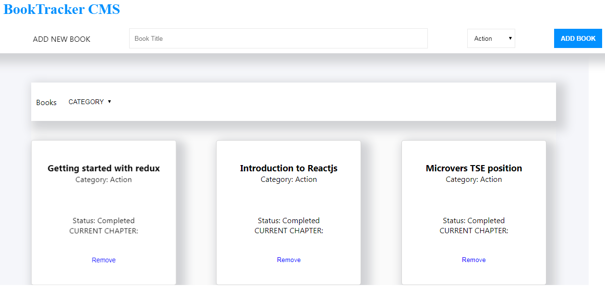

A bookstore management tool with React and Redux
================================================

### Introduction

Redux-bookstore is the front-end of a bookstore management system with objective to store and manage the progress of books read by a given user.

### Built with

*   Node.js
*   React
*   React-DOM
*   React-Create-App
*   Redux
*   npm
*   CSS
*   ES6

### Features

* Display books from store
* Add books to store
* Delete books from store
* Filter books to display by category

### live Demo
https://booktracker.netlify.com

 Getting Started
---------------

### Prerequisites

### Setup

clone the project repo navigate into the project directory; cd redux-bookstore

### Install

install dependencies by running $ npm install

### Usage

run npm start

### Contributions

issues and feature requests are welcome! Feel free to check the issues page. Show your support Give a star if you like this project!

👤 **Author**
Ngodi albert
- Github: [@ngodi](https://github.com/ngodi)
- Twitter: [@albertngodi](https://twitter.com/albertngodi)
- Linkedin: [linkedin](https://www.linkedin.com/in/albertngodi/)

### License

This project is MiT licensed.
